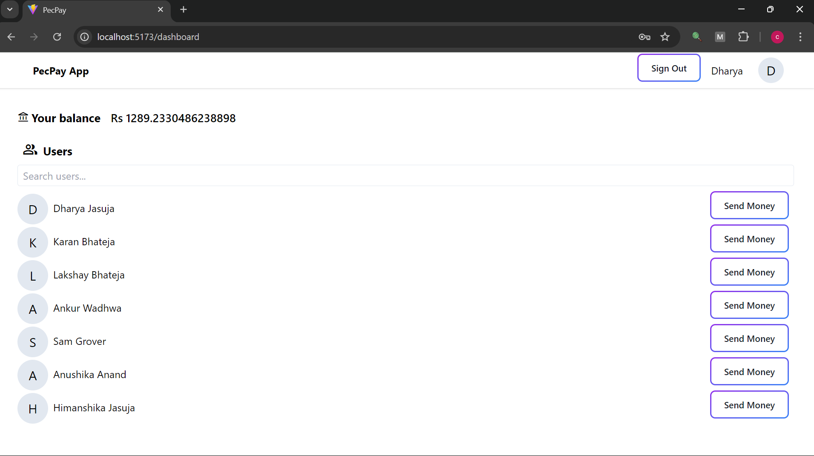

# PecPay: Innovative Student Rewards System

  

**PecPay** is a revolutionary payments platform designed to incentivize and reward students for participating in extracurricular activities. It brings a secure and efficient system to handle transactions while ensuring reliability through ACID-compliant database operations. This app streamlines rewards management for educational institutions.

## 🚀 Features

- **Secure Payment System**: Facilitates secure transactions adhering to ACID principles, ensuring reliability and rollback mechanisms in case of failure.
- **Reward Mechanism**: Automatically rewards students for completing extracurricular activities.
- **Real-Time Updates**: Enables students to view their reward balances and transaction history in real-time.
- **User Management**: Secure role-based access control for students and administrators using ZOD for validation.
- **Responsive Design**: Sleek, mobile-first UI built with React.js and Tailwind CSS for seamless user experience across devices.

## 🛠️ Technologies Used

- **Frontend**: [React.js](https://reactjs.org/), [Tailwind CSS](https://tailwindcss.com/)
- **Backend**: [Node.js](https://nodejs.org/), [Express.js](https://expressjs.com/)
- **Database**: [MongoDB](https://www.mongodb.com/) (ACID-compliant transactions)
- **Validation & Authorization**: [ZOD](https://zod.dev/), [Express.js](https://expressjs.com/)
- **Version Control**: [Git](https://git-scm.com/)

## 📸 Screenshots

*Reward Dashboard Overview*

## 💡 How It Works

1. **User Login**: Secure login for students and administrators with token-based authentication using JWT.
2. **Extracurricular Participation**: Students earn points for participating in activities, which are processed via the backend.
3. **Transaction Processing**: Using MongoDB with ACID transactions, all payments are reliably handled, and any failure triggers a rollback to ensure data consistency.
4. **Role-Based Access**: ZOD ensures secure validation of inputs, and only authorized users can access certain features of the app.

## ⚙️ Future Roadmap

- **Integration with External Payment Gateways**: Add support for real-money rewards with Stripe or PayPal.
- **Expanded Activity Tracking**: Introduce more ways for students to earn points, such as academic achievements.
- **Mobile Application**: Develop mobile apps for iOS and Android platforms.

## 🧑‍💻 Author

- **Dharya Jasuja**  
 

